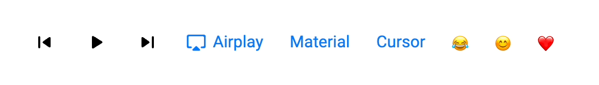
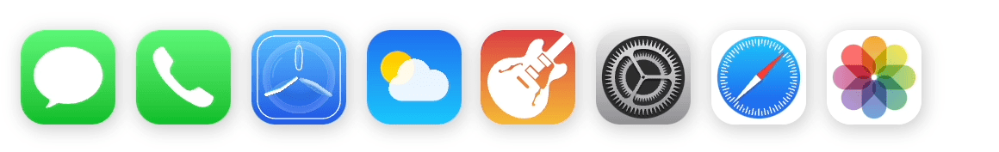
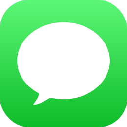
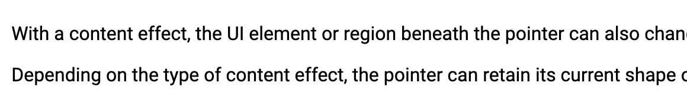

# Cursor.js

iPadOS provides dynamic pointer effects and behaviors that enhance the experience of using a pointing device with iPad.
This experimental library help you to achieve this amazing effect.

[Demo Page](https://github.com/matozz)

## How to use

1. Use `<script>` tag to load Cursor.js in your HTML file：

- UNPKG CDN:

```html
<script src="//unpkg.com/cursorjs" defer></script>
```
2. Follow the exmaples below.

## Supported Effect:


### Highlight effect:

```html
<button>
  
  Airplay
</button>
<button>Material</button>
<button>Cursor</button>
<button>😂</button>
<button>😊</button>
```
> This experimental version will only work  with the default internal button style, we will make the button customizable in future release. 

### Lift effect:

```html


```
> Simply add `id="icon"` to `img` tag 

### Content effect:

```html
<p>
  With a content effect, the UI element or region beneath the pointer can
  also change its appearance when the pointer hovers over it.
</p>
```
> Since there is no way to get each line of text, you need to manually set each line.


### More effects...

## License

Cursor.js is under [MIT](LICENSE) license.